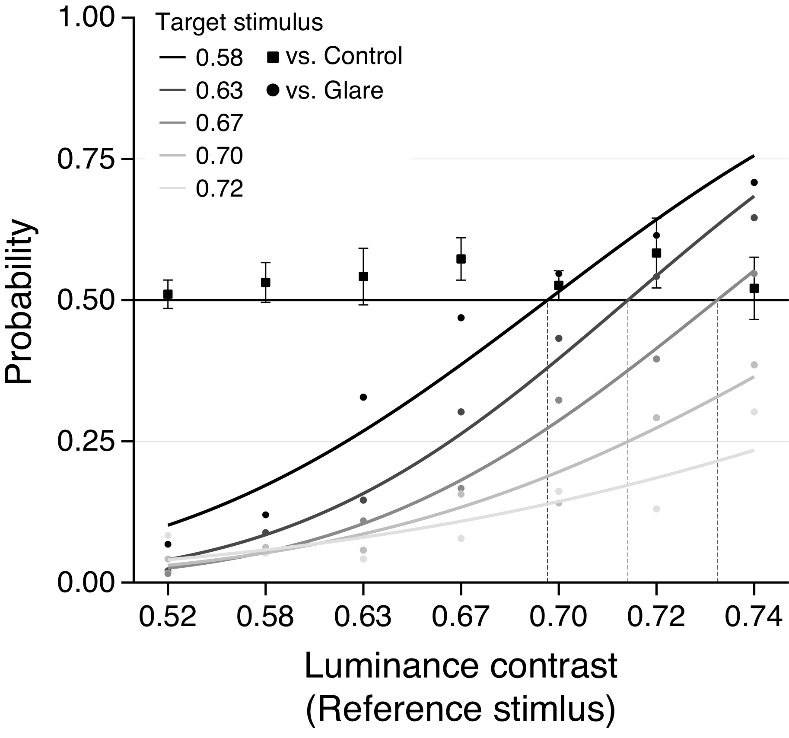

## Appendix 
## Additional experiment: Brightness estimation in the glare illusion with two-alternative forced choice experiment. 
Following Experiment 1 and 2, we conducted a two-alternative forced choice (2AFC) task to confirm perceived brightness enhancement in our luminance condition. The equipment and stimulus property were identical to that used in Experiment 2, except for the luminance contrast condition. Seven luminance contrasts were used (42, 48, 54, 60, 66, 72 and 78 cd/m2).

At the beginning of the trial, the fixation point was presented prior to the stimulus presentation for 1,000 ms. Then, two stimuli were displayed side-by-side: the target stimulus and the reference stimulus at 7.35 degrees from the center of the monitor on either side of the center. The side (left, right) of the target and reference stimuli was determined randomly in each trial but the number of the trials for each stimulus was kept constant (number of trials = = 16). The reference stimulus could be one of 7 luminance patterns of control stimulus (42, 48, 54, 60, 66, 72 and 78 cd/m2). The target stimulus was picked from one of 5 luminance patterns of glare stimulus (48, 54, 60, 66, and 72 cd/m2) or one of 7 luminance patterns of control stimulus as a control condition. Participants were asked to engage in a 2AFC task in which the reference or target stimulus appearing brighter (right or left). The whole experiment therefore consisted of 672 trials (7 references × 5 targets × 16 trials + 7 control stimulus × 16 trials), divided into four sessions. 

The probability with which the participants chose the reference stimulus was calculated. The average probability in each target luminance contrast was fit with a psychometric function which implements the maximum-likelihood method using the Palamedes Toolbox (Prins and Kingdom, 2009). Analysis of the 2AFC task revealed that the brightness perception was clearly enhanced by the glare illusion in every contrast condition used in the prior experiment as shown in Supplemental Figure 1. We estimated the ‘illusory’ brightness to the glare illusion in Contrast of 0.58, 0.63 and 0.57 from Point of Subjective Equality (PSE): 0.685, 0.712 and 0.732 respectively. The results indicated that the perceived brightness enhancement also occurred in the low luminance contrast condition.

Copyright 2019 Yuta Suzuki
