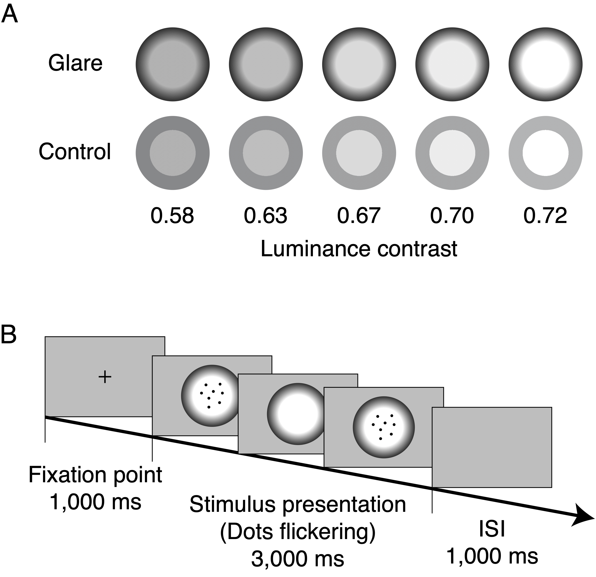

```{r setup, include=FALSE}
knitr::opts_chunk$set(echo = TRUE)
```

```{r child="readFunc.Rmd"}
```

## Article information

Pupil constriction in the glare illusion modulates the steady-state visual evoked potentials


Yuta Suzuki, Minami Tetsuto, Shigeki Nakauchi

*Corresponding author: Yuta Suzuki

## Figure 1
```{r, echo=FALSE, out.width = '100%'}

```

Fig. 1. Glare illusion.The glare illusion consists of a luminance gradation in the periphery. The central region of the glare illusion (left) typically appears brighter than the corresponding control stimulus (right) despite both having the same luminance.

## Figure 2
```{r, echo=FALSE, out.width = '100%'}

```

Fig. 2. Experimental stimuli and design of Experiments 1 and 2.(A)Examples of glare stimuli (above) and control stimuli (below) in five luminance contrast conditions used in Experiment 1 and 2. (B) The identical experiment design was used in both Experiment 1 and 2. Each trial included the presentation of the fixation point for 1000 ms and the presentation of the stimulus (glare or control condition) for 3000 ms. Each trial was separated by an inter-stimulus interval (ISI) of 1000 ms. Participants were instructed to focus on the flickering dots.

## Figure 3
```{r, message=FALSE, warning=FALSE, echo=FALSE, include=FALSE, fig.height=10, fig.width=10}

countFigNum = 1

#### file loading
load("data/dataset_e1e2.rda")
numOfSub = length(unique(data_e1$sub))
subName = NULL

config <- list()

# EEG power -------------------------------------------------------------
p <- ggplot(data_e1_power, aes(x = data_x, y = data_y, colour = Pattern)) +
  geom_line(aes(linetype = Pattern))+
  scale_color_manual(values = c("black", "gray28") )+
  xlab("Frequency[Hz]") + ylab("Evoked-Power[μV]")

config$ylim = round(seq(0,0.3,0.1),2)
config$ylim_stride = 0.02
config$xlim = round(seq(4,16,4),2)
config$xlim_stride = 1

p = setEmptyStyle(p,config)

eval(parse(text=paste("p", countFigNum ,"=p", sep="")))
countFigNum = countFigNum+1

# peak SSVEP amplitude ----------------------------------------------------
config <- list( label_x = "Contrast condition",
                label_y = "Normalized SSVEP amplitude",
                title="",
                grCol = c("black", "gray28", "gray54", "gray75", "gray88",
                          "#FFFFFF", "#FFFFFF", "#FFFFFF", "#FFFFFF", "#FFFFFF"),
                gr_outline = rep(c("black", "gray28", "gray54", "gray75", "gray88"),times=rep(2,5))
)

p <- dispLineGraph(data_e1, config, c("Luminance","Pattern"))

config$ylim = round(seq(0.8,1.4,0.2),2)
config$ylim_stride = 0.1
config$xlim =round(seq(1,5,1),2)
config$xlim_stride = 0.5
p = setEmptyStyle(p,config)

eval(parse(text=paste("p", countFigNum ,"=p", sep="")))
countFigNum = countFigNum+1

# Heatmap of the time frequency plot --------------------------------------
dat <- readMat("data/matData/dat_mean_tf.mat")

sTime = 0.5
eTime = 3

dat_ft = data.frame(
  data_x = rep(rep( seq(min(dat$toi), max(dat$toi), length=length(dat$toi)), length(dat$foi)),2),
  data_y = rep(rep( seq(min(dat$foi), max(dat$foi), length=length(dat$foi)), times = rep(length(dat$toi),length(dat$foi))),2),
  data_z = rbind(matrix( t(dat$y[,,5]), ncol = 1),matrix( t(dat$y[,,10]), ncol = 1))
)
dat_ft$Pattern = rep(c("Glare","Control"),times=c(length(dat_ft$data_x)/2,length(dat_ft$data_x)/2))

dat_ft = dat_ft[dat_ft$data_x > sTime,]
dat_ft = dat_ft[dat_ft$data_x < eTime,]
dat_ft = dat_ft[dat_ft$data_y > 5,]
dat_ft = dat_ft[dat_ft$data_y < 17,]

config <- list(lim_x = c(sTime, eTime),
               lim_y = c(6,18),
               alpha = 1,
               stride = 1,
               label_x = "Time [sec]",
               label_y = "Freqency[Hz]"
)

p <- ggplot(dat_ft,aes(x = data_x, y=data_y)) +
  geom_tile(aes(fill = data_z)) +
  scale_fill_distiller(palette = "Spectral") +
  # scale_y_continuous(breaks = seq(config$lim_y[1],config$lim_y[2],config$stride),expand = c(0, 0)) +
  # scale_x_continuous(breaks = seq(config$lim_x[1],config$lim_x[2],0.5),expand = c(0, 0)) +
  xlab(config$label_x) + ylab(config$label_y) +
  facet_grid(. ~ Pattern)

# p = setFigureStyle(p)
config$xlim = round(seq(0.5,3,0.5),2)
config$xlim_stride = 0.1
config$ylim =round(seq(6,16,1),2)
config$ylim_stride = 0.5

p = p + scale_x_continuous(breaks=config$xlim)
p = setEmptyStyle(p,config)

eval(parse(text=paste("p", countFigNum ,"=p", sep="")))
countFigNum = countFigNum+1

# ANOVA -------------------------------------------------------------------
# anovakun(data_e1,"sAB",gg=T,long=T, peta=T)
# output2wayANOVA(forDrawingSigANOVA)


# # figure output -----------------------------------------------------------
# p = ggarrange(p1, p2, p3,
#               labels = c("B","C", "D"),
#               ncol = 1, nrow = 3)
# print(p)
#
# width_fig=6
# height_fig=4
```

```{r, message=FALSE, warning=FALSE, echo=FALSE, fig.height=10, fig.width=10}
layout <- rbind(c(1,2),c(3,3))
p = combineGraphs(seq(1,countFigNum-1),'p',layout)
# width_fig=13
# height_fig=10
# ggsave(file = "figure/fig2.pdf",
#        plot = p, dpi = 500,
#        width = width_fig, height = height_fig,
#        family="Times")
```

Fig. 3. Results of SSVEP amplitude and topographical map.(A) Topographical map of steady-state visual evoked potential (SSVEP) amplitudes in each Pattern (glare versus control) averaged among Contrast conditions. (B) The grand-averaged SSVEP amplitude was observed at the fundamental frequency of the flickering dots (7.5 Hz). The dashed and solid lines show the result of averaged SSVEP amplitude among Contrast conditions in both the control and glare conditions. (C) The grand-averaged SSVEP amplitude at the frequency of interest of 7.5 Hz for both glare and control conditions for each luminance contrast. The abscissa and ordinate indicate the luminance contrast and the normalized SSVEP amplitude among subjects respectively. Error bars indicate the standard error of the mean. (D) The time course SSVEP amplitude for glare and control in the contrast of 0.72 as examples.

## Figure 4
```{r, message=FALSE, warning=FALSE, echo=FALSE, include=FALSE, fig.height=10, fig.width=10}
countFigNum = 1
sTime = 0
eTime = 3

#### file loading
load("data/dataset_e1e2.rda")
data_e2$data_y = data_e2$data_y * 100 - 100 # to percent from proportion
numOfSub = length(unique(data_e2$sub))

config <- list(lim_x = c(-0.2, eTime),
               lim_y = c(-20,5),
               alpha = 0.1,
               stride = 5,
               label_x = "Time [sec]",
               label_y = "Pupil Changes [%]",
               title = "pupil",
               grCol = rep(c("black", "gray28", "gray54", "gray75", "gray88"),2)
)

# averaged pupil changes from 0 sec to 3 sec ------------------------------------
data_e2_ave = data_e2[data_e2$data_x > 0,]
data_e2_anova = aggregate( data_y ~ sub*Luminance*Pattern, data = data_e2_ave, FUN = "mean")
# data_e2_anova$sub = subName[data_e2_anova$sub]

p <- dispLineGraph(data_e2_anova, config, c("Luminance","Pattern"))
p = setFigureStyle(p)

eval(parse(text=paste("p", countFigNum ,"=p", sep="")))
countFigNum = countFigNum+1

# time course of pupil ------------------------------------------------------------
data_e2_timecourse = aggregate( data_y ~ Luminance*Pattern*data_x, data = data_e2, FUN = "mean")

p <- disp(data_e2_timecourse,config, 0, c("Luminance","interaction(Pattern,Luminance)"))

p = setFigureStyle(p)

p <- p + theme(
  # legend.position = 'none',
  axis.title.x = element_blank(),
  axis.text.x = element_blank(),
  axis.ticks.x = element_blank()
)

eval(parse(text=paste("p", countFigNum ,"=p", sep="")))
countFigNum = countFigNum+1

# time-freqency -----------------------------------------------------------
eeg_data = aggregate( data_y ~ Luminance*Pattern*data_x, data = data_e3, FUN = "mean")

p <- ggplot(eeg_data,aes(x = data_x, y = data_y,group = interaction(Pattern,Luminance))) +
  geom_vline(xintercept=0, colour='black', linetype='longdash', size = 0.1) +
  geom_line(aes(color=Luminance,linetype =Pattern))+
  ylab('Normalized SSVEP amplitude at 7.5Hz') +
  scale_color_manual(values = config$grCol)  +
  scale_x_continuous(breaks = seq(config$lim_x[1],config$lim_x[2],0.5),expand = c(0, 0))

p = setFigureStyle(p)

p <- p + theme(
  legend.position = 'none',
  axis.title.x = element_blank(),
  axis.text.x = element_blank(),
  axis.ticks.x = element_blank()
)
# print(p)
eval(parse(text=paste("p", countFigNum ,"=p", sep="")))
countFigNum = countFigNum+1
```

```{r, message=FALSE, warning=FALSE, echo=FALSE, fig.height=10, fig.width=13}
p = combineGraphs(seq(1,countFigNum-1),'p', NULL)
print(p)

# width_fig=10
# height_fig=9
# ggsave(file = paste(saveLoc,"/fig4AB.pdf", sep = ""),
#        plot = p, dpi = 300,
#        width = width_fig, height = height_fig,
# family="Times")

```

Fig. 4. Pupil response.(A) The averaged pupil changes from 500 ms to 3000 ms of viewing for each Pattern and Contrast condition. The asterisks (*) indicate a statistical significance of p < 0.05. Error bars represent the standard error of the mean. (B) The time course of the SSVEP amplitudes and pupil responses for each Pattern and Contrast condition. The horizontal axis indicates the time from −200 ms to 3000 ms (i.e. from baseline area to stimulus offset). The grand-averaged SSVEP amplitude at the frequency of interest of 7.5 Hz from a time-frequency analysis shown in the top panel, as well as the time course of pupil response in the middle panel. The dashed and solid lines show the result of control and glare condition, respectively. The color gradations indicate each Contrast condition. The bottom panel shows t-values on the correlation across Contrast in each Pattern between the SSVEP amplitude (top panel) and the pupil constriction (middle panel) in each time period using a simple regression model. The gray-shaded areas show a significant correlation of p < 0.05. The p values were corrected for multiple comparisons with an expected FDR of 0.05.

## Figure 5
```{r, message=FALSE, warning=FALSE, echo=FALSE, include=FALSE, fig.height=10, fig.width=13}

countFigNum = 1
sTime = 0
eTime = 3

timeWin = c(1,3)

config <- list(lim_x = c(-0.2, eTime),
               lim_y = c(-20,5),
               sigBarLoc = c(-4.3,-4.4),
               alpha = 0.1,
               stride = 5,
               label_x = "Time [sec]",
               label_y = "Pupil Changes [%]",
               title = "pupil",
               grCol = rep(c("black", "gray28", "gray54", "gray75", "gray88"),2),
               lineTp = c("solid","solid")
)

# t plot  -----------------------------------------------------------------
load("data/dataset_e1e2.rda")
data_e2$data_y = data_e2$data_y * 100 - 100 # to percent from propotion

data_e2_ave = data_e2
data_e2_ave = data_e2_ave[order(data_e2_ave$sub,data_e2_ave$Luminance,data_e2_ave$Pattern),]
data_e3 = data_e3[order(data_e3$sub,data_e3$Luminance,data_e3$Pattern),]

data_e2_ave$ft = data_e3$data_y

data_e2_ave = data_e2_ave[data_e2_ave$data_x >= 0,]
timeLen = length(data_e2_ave$data_x[data_e2_ave$sub == '1'])/10
data_e2_ave$sub = subName[data_e2_ave$sub]

numOfSub = length(unique(data_e2_ave$sub))

## normalization
# max_ft = matrix(tapply(data_e2_ave$ft, data_e2_ave$sub, max), ncol=1)
# data_e2_ave$max_ft = rep(max_ft,times=rep(timeLen*10,numOfSub))
# data_e2_ave$ft = mapply(function(x, y) {return (x / y)}, data_e2_ave$ft,data_e2_ave$max_ft)
load("data/dataset_figure5.rda")

##### across luminance #####
tVal = NULL
pVal = NULL
g1_name = c("0.58","0.63","0.67","0.70","0.72")
p1_name=c("Glare","Control")

for (pat in 1:2){
  for (j in 1:5){
    for (i in 1:timeLen){
      dat = data_e2_ave[
        data_e2_ave$Luminance == g1_name[j] &
          data_e2_ave$Pattern == p1_name[pat] &
          data_e2_ave$data_x == data_e2_ave$data_x[i],]
      res = lm( ft  ~ data_y, data = dat)
      tVal = rbind(tVal,round(summary(res)$coefficients[2,"t value"], digits = 4))
      pVal = rbind(pVal,round(summary(res)$coefficients[2,"Pr(>|t|)"], digits = 4))
    }
  }
}

dat_t = data.frame(
  data_y = tVal,
  data_x = data_e2_ave$data_x[1:timeLen],
  Luminance = rep(g1_name, times = rep(timeLen,5)),
  Pattern = rep(p1_name, times = rep(timeLen,2))
)
time_p = data.frame(
  data_y = rep(0,length(tVal)),
  data_x = data_e2_ave$data_x[1:timeLen],
  Luminance = rep(g1_name, times = rep(timeLen,5)),
  Pattern = rep(p1_name, times = rep(timeLen,2))
)

dat_p = data.frame(
  data_y = pVal,
  data_x = data_e2_ave$data_x[1:timeLen],
  Luminance = rep(g1_name, times = rep(timeLen,5)),
  Pattern = rep(p1_name, times = rep(timeLen,2))
)


for (pat in 1:2){
  for (j in 1:5){
    dat = dat_p[dat_p$Pattern == p1_name[pat] &
                  dat_p$Luminance == g1_name[j],]
    ind_uncorrected = which(dat$data_y < 0.05)             # looking for the significant period
    sorted_pdata = sort(dat$data_y[ind_uncorrected])
    order_uncorrected = order(dat$data_y[ind_uncorrected]) #sorting p-value by descending order

    m = length(sorted_pdata)
    h<-NULL
    if(m > 0){
      for(i in 1 : m){
        if(sorted_pdata[i] <= (i/m) * 0.05){
          h[i] = 1
        }else{
          h[i] = 0
        }
      }
      t = which(h == 0)
      if(length(t) > 0){
        order_uncorrected = sort(order_uncorrected[-t])
        corrected_pVal = ind_uncorrected[order_uncorrected]
      }else{
        order_uncorrected = sort(order_uncorrected)
        corrected_pVal = ind_uncorrected[order_uncorrected]
      }
      time_p[time_p$Pattern == p1_name[pat]&
               dat_p$Luminance == g1_name[j],]$data_y[corrected_pVal] = config$sigBarLoc[pat]
    }
  }
}

time_p = time_p[time_p$data_y != 0, ]
p <- ggplot(dat_t,aes(x = data_x, y = data_y, group = Pattern)) +
  geom_line(aes(linetype = Pattern, color = Pattern), size = 0.5) +
  geom_hline(yintercept=0.05, colour="black", linetype="solid", size = 0.5)+
  # geom_line(data=time_p, aes(linetype=Pattern),color = "black", size = 0.5) +
  geom_point(data=time_p, aes(x=data_x, y = data_y, color = Pattern), size = 0.5,shape=15) +
  xlab('Time [sec]') +
  ylab('T-values on correlation') +
  # ggtitle("Correlation in each Contrast and Pattern") +
  ggtitle("A") +
  # scale_color_manual(values = config$grCol)  +
  scale_linetype_manual(values = config$lineTp) +
  scale_x_continuous(breaks = seq(0,config$lim_x[2],1),expand = c(0, 0))

p <- p + facet_grid(. ~ Luminance)
p = setFigureStyle(p)

# eval(parse(text=paste("p", countFigNum ,"=p", sep="")))
# countFigNum = countFigNum+1

#### make csv ----------------------------------------------------------------
tmp = data_e2_ave[data_e2_ave$data_x >= timeWin[1],]
tmp = tmp[tmp$data_x <= timeWin[2],]
e1 = aggregate( ft ~ sub*Luminance*Pattern, data = tmp, FUN = "mean")
e2 = aggregate( data_y ~ sub*Luminance*Pattern, data = tmp, FUN = "mean")
e1$data_y = e2$data_y

print("-------  in each Contrast and Pattern --------")
for (pat in 1:2){
  for (j in 1:5){
    dat = e1[e1$Pattern == p1_name[pat] &
               e1$Luminance == g1_name[j],]

    res = cor.test(dat$data_y,dat$ft, method="pearson")
    print(paste("R = ",round(res$estimate, digits = 3),
                # ", t = ",round(res$statistic, digits = 4),
                ", p = ",round(res$p.value, digits = 3),sep=""))
  }
}

f = data.frame(
  sub = subName[1:numOfSub],
  y = matrix(e1$ft, nrow = numOfSub, ncol=10),
  y2 = matrix(e1$data_y, nrow = numOfSub, ncol=10)
)

# names(f) <- c("sub",
#               "e1-g-0.58","e1-g-0.63","e1-g-0.67","e1-g-0.70","e1-g-0.72","e1-c-0.58","e1-c-0.63","e1-c-0.67","e1-c-0.70","e1-c-0.72",
#               "e2-g-0.58","e2-g-0.63","e2-g-0.67","e2-g-0.70","e2-g-0.72","e2-c-0.58","e2-c-0.63","e2-c-0.67","e2-c-0.70","e2-c-0.72")
# write.csv(f, paste(saveLoc,"/", "across_luminance.csv", sep = ""), row.names=F, col.names=F)

# among luminance ---------------------------------------------------------
tVal = NULL
pVal = NULL

for (pat in 1:2){
  for (i in 1:timeLen){
    dat = data_e2_ave[
      data_e2_ave$Pattern == p1_name[pat] &
        data_e2_ave$data_x == data_e2_ave$data_x[i],]
    res = lm( ft  ~ data_y, data = dat)
    tVal = rbind(tVal,round(summary(res)$coefficients[2,"t value"], digits = 4))
    pVal = rbind(pVal,round(summary(res)$coefficients[2,"Pr(>|t|)"], digits = 4))
   }
}

dat_t = data.frame(
  data_y = tVal,
  data_x = data_e2_ave$data_x[1:timeLen],
  Pattern = rep(p1_name, times = rep(timeLen,2))
)

time_p = data.frame(
  data_y = rep(0,length(tVal)),
  data_x = data_e2_ave$data_x[1:timeLen],
  Pattern = rep(p1_name, times = rep(timeLen,2))
)

dat_p = data.frame(
  data_y = pVal,
  data_x = data_e2_ave$data_x[1:timeLen],
  Pattern = rep(p1_name, times = rep(timeLen,2))
)

config$sigBarLoc = c(-5.8,-6.0)

for (pat in 1:2){
  dat = dat_p[dat_p$Pattern == p1_name[pat],]
  ind_uncorrected = which(dat$data_y < 0.05)             # looking for the significant period
  sorted_pdata = sort(dat$data_y[ind_uncorrected])
  order_uncorrected = order(dat$data_y[ind_uncorrected]) #sorting p-value by descending order

  m = length(sorted_pdata)
  if(m > 0){
    h<-NULL
    for(i in 1 : m){
      if(sorted_pdata[i] <= (i/m) * 0.05){
        h[i] = 1
      }else{
        h[i] = 0
      }
    }
    t = which(h == 0)
    if(length(t) > 0){
      order_uncorrected = sort(order_uncorrected[-t])
      corrected_pVal = ind_uncorrected[order_uncorrected]
    }else{
      order_uncorrected = sort(order_uncorrected)
      corrected_pVal = ind_uncorrected[order_uncorrected]
    }
    time_p[time_p$Pattern == p1_name[pat],]$data_y[corrected_pVal] = config$sigBarLoc[pat]
  }
}

time_p = time_p[time_p$data_y != 0, ]
p <- ggplot(dat_t,aes(x = data_x, y = data_y, group = Pattern)) +
  geom_line(aes(linetype = Pattern, color = Pattern), size = 0.5) +
  geom_hline(yintercept=0.05, colour="black", linetype="solid", size = 0.5)+
  # geom_line(data=time_p,aes(linetype=Pattern),color = "black", size = 0.5) +
  geom_point(data=time_p, aes(x=data_x, y = data_y, color = Pattern), size = 0.5,shape=15) +
  xlab('Time [sec]') +
  ylab('T-values on correlation') +
  xlab('Time [sec]') +
  # ggtitle("Correlation across Contrast in each Pattern") +
  ggtitle("B") +
  # scale_color_manual(values = config$grCol)  +
  scale_linetype_manual(values = config$lineTp) +
  scale_x_continuous(breaks = seq(0,config$lim_x[2],1),expand = c(0, 0))

p = setFigureStyle(p)

# eval(parse(text=paste("p", countFigNum ,"=p", sep="")))
# countFigNum = countFigNum+1

# make csv ----------------------------------------------------------------
print("-------  across Contrast in each Pattern   --------")
for (pat in 1:2){
  dat = e1[e1$Pattern == p1_name[pat],]
  res = lm( ft ~ data_y, data = dat)
  # print(paste("y = ", round(summary(res)$coefficients[2,"Estimate"], digits = 3),
  #             "x + ", round(summary(res)$coefficients[1,"Estimate"], digits = 3),
  #             ", t = ", round(summary(res)$coefficients[2,"t value"], digits = 3),
  #             ", p = ", round(summary(res)$coefficients[2,"Pr(>|t|)"], digits = 6),
  #             ", R = ", round(cor.test(dat$ft,dat$data_y, method="pearson")$estimate, digits = 4), sep=""))
}

f = data.frame(
  sub = subName[1:numOfSub],
  y  = matrix(e1$ft, nrow = numOfSub*5, ncol=2),
  y2 = matrix(e1$data_y, nrow = numOfSub*5, ncol=2)
)

# names(f) <- c("sub",
#               "ft_g","ft-c","p_g","p_c")
# write.csv(f, paste(saveLoc,"/", "among_luminance.csv", sep = ""), row.names=F, col.names=F)

# across pattern ---------------------------------------------------------
tVal = NULL
pVal = NULL

for (j in 1:5){
  for (i in 1:timeLen){
    dat = data_e2_ave[
      data_e2_ave$Luminance == g1_name[j] &
        data_e2_ave$data_x == data_e2_ave$data_x[i],]
    res = lm( ft  ~ data_y, data = dat)
    tVal = rbind(tVal,round(summary(res)$coefficients[2,"t value"], digits = 4))
    pVal = rbind(pVal,round(summary(res)$coefficients[2,"Pr(>|t|)"], digits = 4))
  }
}

dat_t = data.frame(
  data_y = tVal,
  data_x = data_e2_ave$data_x[1:timeLen],
  Luminance = rep(g1_name, times = rep(timeLen,5))
)
time_p = data.frame(
  data_y = rep(0,length(tVal)),
  data_x = data_e2_ave$data_x[1:timeLen],
  Luminance = rep(g1_name, times = rep(timeLen,5))
)

dat_p = data.frame(
  data_y = pVal,
  data_x = data_e2_ave$data_x[1:timeLen],
  Luminance = rep(g1_name, times = rep(timeLen,5))
)

config$sigBarLoc = c(-4.1,-4.2)

for (j in 1:5){
  dat = dat_p[dat_p$Luminance == g1_name[j],]

  ind_uncorrected = which(dat$data_y < 0.05)             # looking for the significant period
  sorted_pdata = sort(dat$data_y[ind_uncorrected])
  order_uncorrected = order(dat$data_y[ind_uncorrected]) #sorting p-value by descending order

  m = length(sorted_pdata)
  if(m > 0){
    h<-NULL
    for(i in 1 : m){
      if(sorted_pdata[i] <= (i/m) * 0.05){
        h[i] = 1
      }else{
        h[i] = 0
      }
    }
    t = which(h == 0)
    if(length(t) > 0){
      order_uncorrected = sort(order_uncorrected[-t])
      corrected_pVal = ind_uncorrected[order_uncorrected]
    }else{
      order_uncorrected = sort(order_uncorrected)
      corrected_pVal = ind_uncorrected[order_uncorrected]
    }
    time_p[time_p$Luminance == g1_name[j],]$data_y[corrected_pVal] = config$sigBarLoc[pat]
  }
}

time_p = time_p[time_p$data_y != 0, ]
p <- ggplot(dat_t,aes(x = data_x, y = data_y, group = Luminance)) +
  geom_line(aes(color = Luminance), size = 0.5) +
  geom_hline(yintercept=0.05, aes(colour=Pattern), linetype="solid", size = 0.5)+
  # geom_line(data=time_p,color = "black", size = 0.5) +
  geom_point(data=time_p, aes(x=data_x, y = data_y,color = Luminance), size = 0.5,shape=15) +
  xlab('Time [sec]') +
  ylab('T-values on correlation') +
  # ggtitle("Correlation in each Contrast across Pattern") +
  # ggtitle("C") +
  scale_color_manual(values = config$grCol) +
  scale_x_continuous(breaks = seq(0,config$lim_x[2],1),expand = c(0, 0))
p <- p + facet_grid(. ~ Luminance)
p = setFigureStyle(p)

eval(parse(text=paste("p", countFigNum ,"=p", sep="")))
countFigNum = countFigNum+1


# make csv ----------------------------------------------------------------
print("-------  in each Contrast across Pattern  --------")

for (j in 1:5){
  dat = e1[e1$Luminance == g1_name[j],]
  res = lm( ft  ~ data_y, data = dat)
  print(paste(
    ", R = ", round(cor.test(dat$ft,dat$data_y, method="pearson")$estimate, digits = 4),
    ", p = ", round(summary(res)$coefficients[2,"Pr(>|t|)"], digits = 4),sep=""))
}

f = data.frame(
  sub = subName[1:numOfSub],
  y =  rbind(matrix(e1$ft, nrow = numOfSub, ncol=10)[,1:5],
             matrix(e1$ft, nrow = numOfSub, ncol=10)[,6:10]),
  y2 = rbind(matrix(e1$data_y, nrow = numOfSub, ncol=10)[,1:5],
             matrix(e1$data_y, nrow = numOfSub, ncol=10)[,6:10])
)

# names(f) <- c("sub",
#               "ft0.58","ft0.63","ft0.67","ft0.70","ft0.72","p0.58","p0.63","p0.67","p0.70","p0.72")
# write.csv(f, paste(saveLoc, "across_pattern.csv", sep = ""), row.names=F, col.names=F)

# across all ---------------------------------------------------------------------
print("-------  across all  --------")
dat = e1
res = lmer( data_y ~ ft + (1+ft|Luminance),data = dat)
# print(paste(
#   "y = ", round(summary(res)$coefficients[2,"Estimate"], digits = 3),
#   "x + ", round(summary(res)$coefficients[1,"Estimate"], digits = 3),
#   ", t = ", round(summary(res)$coefficients[2,"t value"], digits = 3),
#   ", p = ", round(summary(res)$coefficients[2,"Pr(>|t|)"], digits = 6),
#   ", R = ", round(cor.test(dat$ft,dat$data_y, method="pearson")$estimate, digits = 4), sep=""))

newavg <- data.frame(ft = seq(0,0.85,0.05))
newavg$reaction <- predict(res, re.form = NA, newavg)

interc_val = ranef(res)$Luminance$`(Intercept)` + summary(res)$coefficients[1,"Estimate"]
slope_val = ranef(res)$Luminance$ft + summary(res)$coefficients[2,"Estimate"]

p <- ggplot(dat,aes(x = ft, y = data_y,color=Luminance)) +
  geom_abline(intercept = interc_val, slope = slope_val, size = 0.1) +
  geom_abline(intercept = summary(res)$coefficients[1,"Estimate"], slope = summary(res)$coefficients[2,"Estimate"], size = 1,color='black') +
  scale_color_manual(values = config$grCol) +
  xlab('Normalized SSVEP amplitude at 7.5Hz') +
  ylab('Pupil change') +
  ggtitle("D") +
  geom_point(aes(shape=Pattern),size=2)
p = setFigureStyle(p)

```

```{r, message=FALSE, warning=FALSE, echo=FALSE, fig.height=5, fig.width=10}
# show graph  --------------------------------------------------------------
# layout <- rbind(c(1, 1),
#                 c(2, 2),
#                 c(3, 3))
# p = combineGraphs(seq(1,countFigNum-1),'p', layout)
print(p1)
# width_fig=10
# height_fig=10
# ggsave(file = paste(saveLoc,"/fig4B5.pdf", sep = ""),
#        plot = p, dpi = 300,
#        width = width_fig, height = height_fig)
```

Fig. 5. Time course correlations between the SSVEP amplitude and pupil response.T-values on the correlation between the SSVEP amplitude and the pupil response in each Contrast across Pattern. The lumi- nance contrast values are shown on the top of the graphs. The gray-shaded areas indicate the significant correlation area of FDR corrected p < 0.05.

## Figure SI
```{r, message=FALSE, warning=FALSE, echo=FALSE, include=FALSE, fig.height=10, fig.width=13}
load("data/dataset_sup.rda")
g1_name = c("0.52","0.58","0.63","0.67","0.7","0.72","0.74")
g1_name = c(0.52,0.58,0.63,0.67,0.7,0.72,0.74)

numOfSub = length(unique(data_sup$sub))
subName = NULL

config <- list(lim_x = c(0.5,7.5),
               lim_y = c(0,1),
               stride =c(-0.3,-0.2,-0.1,-0.0,0.1,0.2),
               alpha_val = 0.5,
               label_x = "Contrast condition",
               label_y = "Probability",
               title="SI=0.5sec, CI=duration",
               gr_outline = c("black", "gray28", "gray54", "gray75", "gray88")
)

std_data = aggregate( data_y ~ Pattern*Luminance*Target*cell*n, data = data_sup, FUN = "sd")
data_sup_mean = aggregate( data_y ~ Pattern*Luminance*Target*cell*n, data = data_sup, FUN = "mean")

std_data$data_y <- std_data$data_y / sqrt(numOfSub)

data_sup_mean$SE_min <- data_sup_mean$data_y - std_data$data_y
data_sup_mean$SE_max <- data_sup_mean$data_y + std_data$data_y

p <- ggplot(data_sup_mean[data_sup_mean$Pattern=='Control',], aes(cell, data_y))+
  geom_point(shape=0, size = 2) +
  scale_color_manual(values = config$gr_outline)+
  xlab(config$label_x) + ylab(config$label_y) +
  geom_hline(yintercept=0.5, colour='black', linetype='solid', size = 0.1) +
  geom_errorbar(aes(ymin = SE_min, ymax = SE_max),width = 0.1, size=0.2) +
  scale_x_continuous(breaks = 1:7,label = g1_name) +
  scale_y_continuous(expand = c(0, 0)) +
  coord_cartesian(ylim = config$lim_y)

data_sup_mean = data_sup_mean[data_sup_mean$Pattern=='Glare',]
data_sup_mean$cell = rep(1:7,5)

g1_name = c("0.58","0.63","0.67","0.7","0.72")
# g1_name = c(0.58,0.63,0.67,0.7,0.72)

data_sup_mean$Target = rep(g1_name,times=rep(7,5))

p <- p +
  geom_point(data=data_sup_mean,aes(x = cell, y = data_y, color = Target),shape=16,size = 2)

# g1_name = c(0.58,0.63,0.67,0.7,0.72)
psyCurves = data.frame()
dat_th = NULL
for (i in 1:length(g1_name)){
  tx = data_sup_mean[data_sup_mean$Target == g1_name[i],]
  g = c(0.52,0.58,0.63,0.67,0.7,0.72,0.74)
  g = 1:7
  tx$cell = g[tx$cell]
  fit <- quickpsy(tx, cell, data_y, n)
  t = fit$curves
  t$Target = rep(g1_name[i], dim(fit$curves)[1])
  psyCurves = rbind(psyCurves,t)
  dat_th = rbind(dat_th, fit$thresholds[,"thre"])
}

p <- p +
  geom_line(data= psyCurves, aes(x = x, y = y,color = Target)) + 
  geom_vline(xintercept=dat_th[1], colour='black', linetype='longdash', size = 0.1) +
  geom_vline(xintercept=dat_th[2], colour='black', linetype='longdash', size = 0.1) +
  geom_vline(xintercept=dat_th[3], colour='black', linetype='longdash', size = 0.1)

p = setFigureStyle(p)
print(p)

freqInd1 <- which( abs(psyCurves$x-dat_th[5]) == min(abs(psyCurves$x-dat_th[5])) )
psyCurves$x[281]

# 195 236 281 300 

# width_fig=8
# height_fig=6
# ggsave(file = paste(saveLoc,"/fig_SI.pdf", sep = ""),
#        plot = p, dpi = 300,
#        width = width_fig, height = height_fig,
#        family="Times")

# per perticipants --------------------------------------------------------
# load("/dataset_sup.rda")
# data_sup = data_sup[data_sup$Pattern=='Glare',]
# data_sup$cell = rep(rep(1:7,times = rep(6,7)),5)
# g1_name = c("0.58","0.63","0.67","0.7","0.72")
# data_sup$Target = rep( rep(g1_name,times = rep(6,5)) ,times=rep(7,30))
# 
# psyCurves = data.frame()
# 
# dat_th = NULL
# g1_name = c(0.58,0.63,0.67,0.7,0.72)
# g = 1:7
# 
# for(iSub in 1:1){
#   dat = data_sup[data_sup$sub == iSub,]
#   for (i in 1:length(g1_name)){
#     tx = dat[dat$Target == g1_name[i],]
#     tx$cell = g[tx$cell]
#     fit <- quickpsy(tx, cell, data_y, n)
#     t = fit$curves
#     t$Target = rep(g1_name[i],dim(fit$curves)[1])
#     t$sub = rep(iSub,dim(fit$curves)[1])
#     psyCurves = rbind(psyCurves,t)
#     dat_th = rbind(dat_th,fit$thresholds[,"thre"])
#   }
# }
# p <- ggplot(data_sup,aes(cell, data_y,color = Target))+
#   geom_point(shape=0, size = 2) +
#   geom_line(data= psyCurves, aes(x = x, y = y,color = interaction(sub,Target)))
# 
# anova_data = data.frame(
#   sub = rep(1:6,times=rep(5,6)),
#   Luminance = rep(g1_name,6),
#   data_y = dat_th
# )
```

```{r, message=FALSE, warning=FALSE, echo=FALSE, fig.height=5, fig.width=10}
print(p)
```
