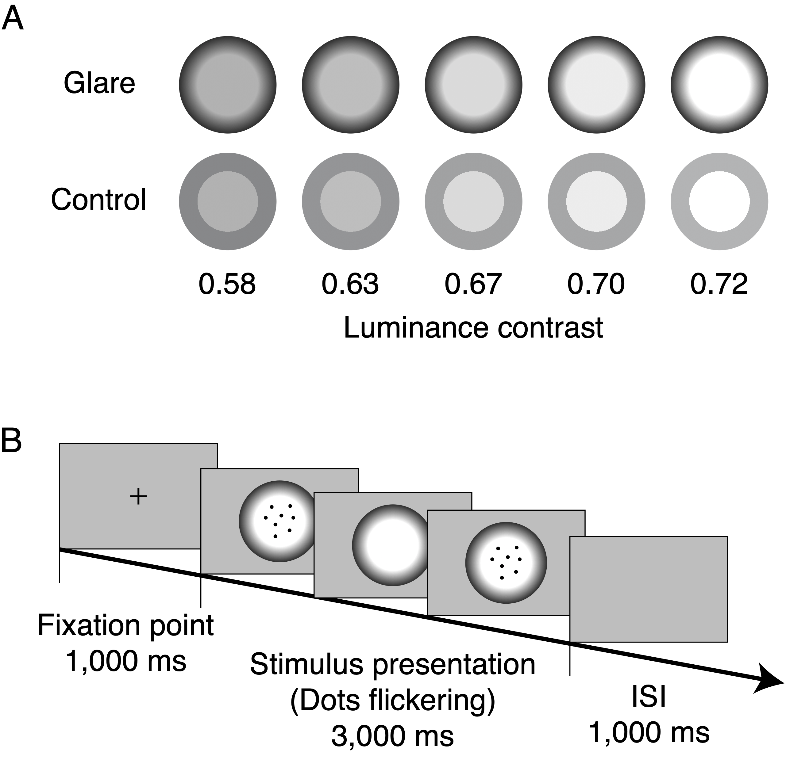

## Article information

Pupil constriction in the glare illusion modulates the steady-state
visual evoked potentials

Yuta Suzuki, Minami Tetsuto, Shigeki Nakauchi

\*Corresponding author: Yuta Suzuki

## Figure 1

Fig. 1. Glare illusion.The glare illusion consists of a luminance
gradation in the periphery. The central region of the glare illusion
(left) typically appears brighter than the corresponding control
stimulus (right) despite both having the same luminance.

## Figure 2

Fig. 2. Experimental stimuli and design of Experiments 1 and
2.(A)Examples of glare stimuli (above) and control stimuli (below) in
five luminance contrast conditions used in Experiment 1 and 2. (B) The
identical experiment design was used in both Experiment 1 and 2. Each
trial included the presentation of the fixation point for 1000 ms and
the presentation of the stimulus (glare or control condition) for 3000
ms. Each trial was separated by an inter-stimulus interval (ISI) of 1000
ms. Participants were instructed to focus on the flickering dots.

## Figure 3

Fig. 3. Results of SSVEP amplitude and topographical map.(A)
Topographical map of steady-state visual evoked potential (SSVEP)
amplitudes in each Pattern (glare versus control) averaged among
Contrast conditions. (B) The grand-averaged SSVEP amplitude was observed
at the fundamental frequency of the flickering dots (7.5 Hz). The dashed
and solid lines show the result of averaged SSVEP amplitude among
Contrast conditions in both the control and glare conditions. (C) The
grand-averaged SSVEP amplitude at the frequency of interest of 7.5 Hz
for both glare and control conditions for each luminance contrast. The
abscissa and ordinate indicate the luminance contrast and the normalized
SSVEP amplitude among subjects respectively. Error bars indicate the
standard error of the mean. (D) The time course SSVEP amplitude for
glare and control in the contrast of 0.72 as examples.

## Figure 4

Fig. 4. Pupil response.(A) The averaged pupil changes from 500 ms to
3000 ms of viewing for each Pattern and Contrast condition. The
asterisks (\*) indicate a statistical significance of p &lt; 0.05. Error
bars represent the standard error of the mean. (B) The time course of
the SSVEP amplitudes and pupil responses for each Pattern and Contrast
condition. The horizontal axis indicates the time from −200 ms to 3000
ms (i.e. from baseline area to stimulus offset). The grand-averaged
SSVEP amplitude at the frequency of interest of 7.5 Hz from a
time-frequency analysis shown in the top panel, as well as the time
course of pupil response in the middle panel. The dashed and solid lines
show the result of control and glare condition, respectively. The color
gradations indicate each Contrast condition. The bottom panel shows
t-values on the correlation across Contrast in each Pattern between the
SSVEP amplitude (top panel) and the pupil constriction (middle panel) in
each time period using a simple regression model. The gray-shaded areas
show a significant correlation of p &lt; 0.05. The p values were
corrected for multiple comparisons with an expected FDR of 0.05.

## Figure 5

Fig. 5. Time course correlations between the SSVEP amplitude and pupil
response.T-values on the correlation between the SSVEP amplitude and the
pupil response in each Contrast across Pattern. The lumi- nance contrast
values are shown on the top of the graphs. The gray-shaded areas
indicate the significant correlation area of FDR corrected p &lt; 0.05.

## Figure SI

