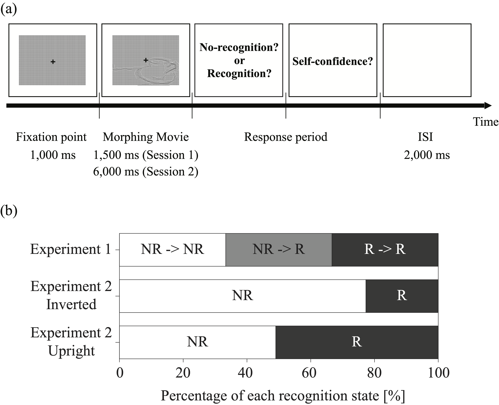

```{r setup, include=FALSE}
knitr::opts_chunk$set(echo = TRUE)
```

```{r child="readFunc.Rmd"}
```

## Article information

Pupil constriction in the glare illusion modulates the steady-state visual evoked potentials


Yuta Suzuki, Minami Tetsuto, Shigeki Nakauchi

*Corresponding author: Yuta Suzuki

## Figure 1
```{r, echo=FALSE, out.width = '100%'}

```

Figure 1. Experimental design and the percentage of each recognition state. (a) Protocol for Experiment 1.
In each trial, a fixation point was presented for 1,000 ms prior to presentation of the stimulus. Each movie was presented for 1,500 ms in the first session and 6,000 ms in the second session. Each trial was separated by an inter-stimulus interval (ISI) of 2,000 ms. Participants reported whether they were able to recognize the contents of the movie following each trial using the keypad. (b) This percentage represents the averaged trial ratio of each recognition state among participants: PNN, PNR, and PRR conditions. All trials consisted of 60 movies in Experiment 1 and 40 movies in Experiment 2. Therefore, 100% denotes the total number of trials for which responses were provided.

## Figure 2
```{r, message=FALSE, warning=FALSE, echo=FALSE, include=FALSE}

countFigNum = 1
fileLoc = 'data/'
# time course -------------------------------------------------------------
PLRdata <- readMat(paste(fileLoc,"Exp1/data1.mat", sep = "")) # reading data
PLRdata$anovaData = PLRdata$anovaData * 100 - 100 # ratio to percent

sTime = -0.5
eTime = 1.5

g <- c("PN","PR")

# d <- makeDataSetAll(PLRdata, g, seq(sTime,eTime,length=dim(PLRdata$anovaData)[2])) # making dataset using shaded_error.R

dataLen = dim(PLRdata$anovaData)[2]

d <- data.frame(
  sub = rep(1:dim(PLRdata$anovaData)[1],times=rep(dataLen,dim(PLRdata$anovaData)[1])),
  data_y = c(matrix(t(PLRdata$anovaData[,,1])),matrix(t(PLRdata$anovaData[,,2]))),
  data_x = seq(sTime, eTime, length = dataLen),
  responses = c(rep(g[1],length(matrix(t(PLRdata$anovaData[,,1])))),rep(g[2],length(matrix(t(PLRdata$anovaData[,,1])))))
)

config <- list(lim_x = c(-0.2, 1.5),
               lim_y = c(-1, 4),
               alpha = 0.3,
               label_x = "Condition",
               label_y = "Pupil Changes [%]"
               # grCol = c("#00BFC4","#F8766D"),
               # gr_point = c("#F8766D","#ECB01F","#619CFF"),
               # grName <- c(expression(paste("R"["1.5s"])),expression(paste("NR"["1.5s"])))
)

# adjustment of p-value by False Discovery Rate
d1 = PLRdata$anovaData[,,1]
d2 = PLRdata$anovaData[,,2]
pData<-NULL

for (i in 1:dim(d1)[2]){
  a <- t.test( d1[,i], d2[,i], paired=T) # paired t-test
  # t.test(dat_w,dat_m,paired=T
  pData[i]=a$p.value
}

ind_uncorrected = which(pData < 0.05) # looking for the significant period
sorted_pdata = sort(pData[ind_uncorrected]) # looking for the significant period
order_uncorrected = order(pData[ind_uncorrected]) #sorting p-value by descending order

m = length(sorted_pdata)
h<-NULL
for(i in 1 : m){ 
  if(sorted_pdata[i] <= (i/m) * 0.05){
    h[i] = 1
  }else{
    h[i] = 0
  }
}
t = which(h == 0)
order_uncorrected = sort(order_uncorrected[-t])
corrected_pVal = ind_uncorrected[order_uncorrected]

# corrected_pVal = (corrected_pVal / (dim(d1)[2])) * (eTime-sTime) + sTime

dat_p = data.frame(
  pVal = 0,
  data_y = -1,
  data_x = unique(d$data_x),
  responses = 'sig'
  # condition='sig',
  # flag = 'white'
)

dat_p$pVal[corrected_pVal] = 1

dat_p['flag'] = rep('white',dim(dat_p)[1])
ind = dat_p['pVal'] == 1
dat_p['data_y'][ind] = -1
dat_p['flag'][ind] = 'black'

# show time course of pupil 
p <- disp(d,config,1,c('responses','responses'))+
  geom_point(data=dat_p, aes(x=data_x, y = data_y),color=dat_p$flag, size = 2,shape=15)
p = setFigureStyle(p)

eval(parse(text=paste("p", countFigNum ,"=p", sep="")))
countFigNum = countFigNum+1

# time-course N->R -------------------------------------------------------------
PLRdata <- readMat(paste(fileLoc,"Exp1/data_tmp.mat", sep = "")) # reading data

sTime = -0.5
eTime = 1.5

g1 <- c("NN","NR","RR")

dataLen = dim(PLRdata$data.NN)[2]
numOfSub = dim(PLRdata$data.NN)[1]

ind_data <- data.frame(
  sub = rep(1:numOfSub,times=rep(dataLen,numOfSub)),
  data_y = c(matrix(t(PLRdata$data.NN)),matrix(t(PLRdata$data.NR)),matrix(t(PLRdata$data.RR))),
  data_x = seq(sTime, eTime, length = dataLen),
  responses = rep(g1,times=rep(length(matrix(t(PLRdata$data.NN))),3))
)
ind_data$data_y = ind_data$data_y * 100 - 100 # ratio to percent

p <- disp(ind_data,config,1,c('responses','responses'))

p = setFigureStyle(p)

eval(parse(text=paste("p", countFigNum ,"=p", sep="")))
countFigNum = countFigNum+1

# average -------------------------------------------------------------
PLRdata <- readMat('analysis/Exp1/data3.mat')

x <- data.frame(
  sample = c('NR->NR','NR->R','R->R'),
  y = PLRdata$barDataForR[,1],
  cell   = 1:3
)

numOfSub = dim(PLRdata$ind.data)[2]/3
ind_data <- data.frame(
  sample = rep(c('NR->NR','NR->R','R->R'), times = c(numOfSub,numOfSub,numOfSub)),
  y = PLRdata$ind.data[1,],
  cell   = rep(1:3, times = c(numOfSub,numOfSub,numOfSub)),
  e_p   = rep(1:numOfSub,3)
)

SE_min <- PLRdata$barDataForR[,1] - PLRdata$barDataForR[,2]
SE_max <- PLRdata$barDataForR[,1] + PLRdata$barDataForR[,2]

config <- list(lim_x = c(0.5, 3.5),
               lim_y = c(-5, 7),
               label_x = "Condition",
               label_y = "Pupil Changes [%]",
               gr = c("#FFFFFF","#808080","#1A1A1A"),
               gr_point = c("#F8766D","#ECB01F","#619CFF")
)
jitterVal <- c(rep(-0.225,numOfSub),rep(0.225,numOfSub))

## drawing the graph
p <- ggplot(x, aes(x = cell, y = y, fill = sample))+
  geom_bar(stat = "identity", colour = "black")+
  scale_fill_manual(values = config$gr) +
  
  geom_point(data = ind_data,
             alpha = 0.3,
             aes(cell,y,color=sample)) +
  
  geom_line(data = ind_data,
            size = 0.5,
            alpha = 0.1,
            aes(x = cell, y = y, group = e_p)
  )+
  geom_line(aes(x=c(0,config$lim_x[1],config$lim_x[2]+1),y=c(0,0,0), group = 1), color="black") +
  scale_color_manual(values = config$gr_point) +
  geom_errorbar(aes(ymin = SE_min, ymax = SE_max),
                width = 0.05) +
  coord_cartesian(xlim=config$lim_x, ylim = config$lim_y)+
  scale_y_continuous(breaks = seq(config$lim_y[1],config$lim_y[2],1)) +
  # scale_x_discrete("Condition",
  #                  breaks =  c("A","B","C","D"),
  #                  labels = c('Inverted','Upright',"Inv vs. Up", "InvNR vs. UpR"))
  xlab(config$label_x) + ylab(config$label_y) + 
  scale_x_continuous(breaks = 1:3, 
                     labels = c(expression(paste("P"["NN"])),
                                expression(paste("P"["NR"])),
                                expression(paste("P"["RR"]))))+
  geom_signif(xmin=1, xmax=2, 
              annotations="*", 
              y_position = 5.5, 
              textsize = 5,
              tip_length = 0.01,
              family="Times") +
  geom_signif(xmin=1, xmax=3, 
              annotations="*", 
              y_position = 6.5,
              textsize = 5,
              tip_length = 0.01,
              family="Times")

p = setFigureStyle(p)
eval(parse(text=paste("p", countFigNum ,"=p", sep="")))
countFigNum = countFigNum+1

# confidence ----------------------------------------
PLRdata <- readMat('analysis/Exp1/data4.mat')

g1 <- rep(c('1:Low confidence','2:High confidence'),2)
g2 <- rep(c('NN','NR'),times=c(2,2))
g2 <- rep(1:2,times=c(2,2))

numOfbar = 4
numOfcondition = 2

numOfSub = dim(PLRdata$anovaData)[1]

ind_data <- data.frame(
  sub = 1:numOfSub,
  data_y = matrix(PLRdata$anovaData),
  conf = rep(g1, times = rep(numOfSub,4)),
  responses = rep(g2, times = rep(numOfSub,4)),
  e_p   = c(rep(1:numOfSub, 2),rep((numOfSub+1):(numOfSub*2),2))
)

config <- list(lim_x = c(0.5, 2.5),
               lim_y = c(-6, 14),
               title = "",
               label_x = "Condition",
               label_y = "Pupil Changes [%]",
               gr = rep(c("#FFFFFF","#808080"),2),
               gr_outline = rep(c("#FFFFFF","#808080"),2)
)


jitterVal <- rep(c(rep(-0.225,numOfSub),rep(0.225,numOfSub)),numOfcondition)

p <- dispBarGraph(ind_data,config,c('responses','conf'))+
  geom_point(data = ind_data,
             alpha = 0.3,
             aes(responses,data_y),
             position=position_dodge(.9))+
  geom_line(data = ind_data,
            size = 0.5,
            alpha = 0.1,
            aes(x = responses+jitterVal, y = data_y, group = e_p)) +
  # scale_fill_nejm()+
  coord_cartesian(xlim=config$lim_x, ylim = config$lim_y)+
  scale_y_continuous(breaks = seq(config$lim_y[1],config$lim_y[2],2)) +
  geom_signif(comparisons = list(1:2),
              annotations="*",
              y_position = 13.5,
              textsize = 5,
              tip_length = 0.01,
              family="Times")+
  geom_signif(xmin=0.775,xmax=1.225,
              annotations="n.s.",
              y_position = 12,
              textsize = 5,
              tip_length = 0.01,
              family="Times")+
  geom_signif(xmin=1.775,xmax=2.225,
              annotations="n.s.",
              y_position = 12,
              textsize = 5,
              tip_length = 0.01,
              family="Times")+
  scale_x_continuous(breaks = 1:numOfcondition,
                     labels = c(expression(paste("P"["NN"])), expression(paste("P"["NR"]))))+
  scale_fill_manual(values = config$gr)

p = setFigureStyle(p)
eval(parse(text=paste("p", countFigNum ,"=p", sep="")))
countFigNum = countFigNum+1

```

```{r, message=FALSE, warning=FALSE, echo=FALSE, fig.height=10, fig.width=10}
## show the graph
p = combineGraphs(seq(1,countFigNum-1),'p', NULL)
print(p)
```

Figure 2. The time course of pupil responses based on recognition state. The horizontal axis indicates the time (in ms), while the vertical axis indicates the grand-averaged change in pupil dilation changes from baseline (from −200 ms to 0 ms). Shaded areas represent the standard error of the mean. The statistical significance of the comparisons is indicated by asterisks (*) for p < 0.05. (a) The blue line represents trials in which objects were recognized (R), while the red line represents trials in which objects were not recognized (NR). The gray bar represents the difference between R and NR trials; P values were corrected for multiple comparisons with an expected FDR of 0.05. (b) The grand-averaged time course of pupil changes during stimulus presentation
for the first session (1,500 ms), classified based on subsequent insight during the second session (6,000 ms): no-recognition (NR) to no-recognition (NR), no-recognition (NR) to recognition (R), and recognition (R) to recognition (R). (c) The average pupil dilation from 0 ms to 1,500 ms for each recognition state. The colored circle indicates mean value for each participant data. (d) The average pupil dilation from 0 ms to 1,500 ms for each level of confidence according to subsequent changes in recognition state. The colored circle indicates mean value for each participant data.


## Figure 3
```{r, message=FALSE, warning=FALSE, echo=FALSE, include=FALSE}

countFigNum = 1

# Show the time course ----------------------------------------------------
PLRdata <- readMat('data/Exp2/data1.mat')

g1 = rep(c('NR','R'),2)
g2 = rep(c('inverted','Upright'),times=c(2,2))
g2 = rep(1:2,times=c(2,2))

sTime = -1
eTime = 3
numOfSub = dim(PLRdata$data.inv.NR)[1]
dataLen = dim(PLRdata$data.inv.NR)[2]

ind_data <- data.frame(
  sub =  rep(1:numOfSub,times = rep(dataLen,numOfSub)),
  data_y = c(matrix(t(PLRdata$data.inv.NR)),
             matrix(t(PLRdata$data.inv.R)),
             matrix(t(PLRdata$data.up.NR)),
             matrix(t(PLRdata$data.up.R))),
  data_x = seq(sTime, eTime, length = dataLen),
  responses = rep(g1,times = rep(length(matrix(t(PLRdata$data.inv.NR))),4)),
  pattern = rep(g2,times = rep(length(matrix(t(PLRdata$data.inv.NR))),4))
)

ind_data$data_y = ind_data$data_y * 100 - 100 # ratio to percent

config <- list(lim_x = c(-0.2, 3),
               lim_y = c(-0.5, 8),
               alpha = 0.3,
               label_x = "Time [s]",
               label_y = "Pupil Changes [%]"
               # grCol = c("#ECB01F","#F8766D","#619CFF"),
               # gr_point = c("#F8766D","#ECB01F","#619CFF")
)

# Inverted ----------------------------------------
data_inv = ind_data[ind_data$pattern == 1,]
p <- disp(data_inv,config,1,c("responses","pattern"))
  # facet_wrap(pattern ~ .)
p = setFigureStyle(p)

eval(parse(text=paste("p", countFigNum ,"=p", sep="")))
countFigNum = countFigNum+1

# Upright ----------------------------------------
data_up = ind_data[ind_data$pattern == 2,]
p <- disp(data_up,config,1,c("responses","responses"))
p = setFigureStyle(p)

eval(parse(text=paste("p", countFigNum ,"=p", sep="")))
countFigNum = countFigNum+1

# to same pictures ----------------------------------------
PLRdata <- readMat('data/Exp2/data2.mat')
g1 = c('inv_NR','up_R')

sTime = -1
eTime = 3
numOfSub = dim(PLRdata$data.inv.NR)[1]
dataLen = dim(PLRdata$data.inv.NR)[2]

data_upR_invNR <- data.frame(
  sub = rep(1:numOfSub,times = rep(dataLen,numOfSub)),
  data_y = c(matrix(t(PLRdata$data.inv.NR)),
             matrix(t(PLRdata$data.up.R))),
  data_x = seq(sTime, eTime, length = dataLen),
  responses = rep(g1,times = rep(length(matrix(t(PLRdata$data.inv.NR))),2))
)

data_upR_invNR$data_y = data_upR_invNR$data_y * 100 - 100 # ratio to percent
p <- disp(data_upR_invNR,config,1,c("responses","responses"))
p = setFigureStyle(p)

eval(parse(text=paste("p", countFigNum ,"=p", sep="")))
countFigNum = countFigNum+1

## average ----------------------------------------
data_ave = aggregate( data_y ~ sub*responses*pattern, data = ind_data[ind_data$data_x > 0,], FUN = 'mean')

numOfcondition=2
jitterVal <- rep(c(rep(-0.225,numOfSub),rep(0.225,numOfSub)),numOfcondition)
config <- list(lim_x = c(-0.2, 3),
               lim_y = c(-0.5, 8),
               alpha = 0.3,
               label_x = "Time [s]",
               label_y = "Pupil Changes [%]",
               grCol = c("#FFFFFF","#808080","#FFFFFF","#808080"),
               gr_outline = c("#000000","#000000","#000000","#000000")
)

data_ave$e_p = c(rep(1:numOfSub, 2),rep((numOfSub+1):(numOfSub*2),2))

p <- dispBarGraph(data_ave,config,c('pattern','responses'))+
  geom_point(data = data_ave,
             alpha = 0.3,
             aes(pattern,data_y),
             position=position_dodge(.9))+
  geom_line(data = data_ave,
            size = 0.5,
            alpha = 0.1,
            aes(x = pattern+jitterVal, y = data_y, group = e_p)) +
  # coord_cartesian(xlim=config$lim_x, ylim = config$lim_y)+
  # scale_y_continuous(breaks = seq(config$lim_y[1],config$lim_y[2],2)) +
  geom_signif(comparisons = list(1:2),
              annotations="*",
              y_position = 9,
              textsize = 5,
              tip_length = 0.01,
              family="Times")+
  geom_signif(xmin=0.775,xmax=1.225,
              annotations="*",
              y_position = 8,
              textsize = 5,
              tip_length = 0.01,
              family="Times")+
  geom_signif(xmin=1.775,xmax=2.225,
              annotations="*",
              y_position = 8,
              textsize = 5,
              tip_length = 0.01,
              family="Times")+
  scale_x_continuous(breaks = 1:numOfcondition,
                     labels = c("Inverted", "Upright"))
                     
p = setFigureStyle(p)
  # scale_fill_manual(values = config$gr)
eval(parse(text=paste("p", countFigNum ,"=p", sep="")))
countFigNum = countFigNum+1

## average up-R ind-NR ----------------------------------------
data_upR_invNR_ave = aggregate( data_y ~ sub*responses, data = data_upR_invNR[data_upR_invNR$data_x > 0,], FUN = 'mean')

data_upR_invNR_ave$condition = 0
data_upR_invNR_ave[data_upR_invNR_ave$responses == 'inv_NR',]$condition = 1
data_upR_invNR_ave[data_upR_invNR_ave$responses == 'up_R',]$condition = 2

data_upR_invNR_ave$e_p = c(rep(1:numOfSub, 2))
jitterVal <- c(rep(-0.225,numOfSub),rep(0.225,numOfSub))

p <- dispBarGraph(data_upR_invNR_ave,config,c('condition','responses'))+
  geom_point(data = data_upR_invNR_ave,
             alpha = 0.3,
             aes(condition,data_y))+
  geom_line(data = data_upR_invNR_ave,
            size = 0.5,
            alpha = 0.1,
            aes(x = condition, y = data_y, group = e_p)) +
  geom_signif(comparisons = list(1:2),
              annotations="*",
              y_position = 11,
              textsize = 5,
              tip_length = 0.01,
              family="Times")+
  scale_x_continuous(breaks = 1:numOfcondition,
                   labels = c(expression(paste("Inv"["NR"])), expression(paste("Up"["R"]))))
                     
p = setFigureStyle(p)
  # scale_fill_manual(values = config$gr)
eval(parse(text=paste("p", countFigNum ,"=p", sep="")))
countFigNum = countFigNum+1

```

```{r, message=FALSE, warning=FALSE, echo=FALSE, fig.height=10, fig.width=10}
p = combineGraphs(seq(1,4),'p', NULL)
print(p)
```
```{r, message=FALSE, warning=FALSE, echo=FALSE, fig.height=5, fig.width=5}
print(p5)
```

Figure 3. Pupil responses for inverted and upright versions of identical stimuli. The horizontal axis indicates the time (in ms), while the vertical axis indicates the grand-averaged change in pupil dilation changes from baseline (from −200 ms to 0 ms). Shaded areas represent the standard error of the mean. The statistical significance of the comparisons is indicated by asterisks (*) for p < 0.05. The grand-averaged time course of pupil changes during stimulus presentation for (a) the inverted session and (b) the upright session. The blue line represents trials in which objects were recognized (R), while the red line represents trials in which objects were not recognized (NR). (c) The grand-averaged pupil change classified based on response (recognition vs. non- recognition) to the identical stimulus movie in both the upright and inverted conditions. The pupil dilation was averaged from 0 ms to 3,000 ms during stimulus presentation. Analyses were performed for three recognition states: (d) R: recognition in both upright and inverted conditions, NR: non-recognition in both upright and inverted conditions, (e) InvNRUpR: recognition in upright and non-recognition in inverted condition. The colored circle indicates mean value for each participant data.
