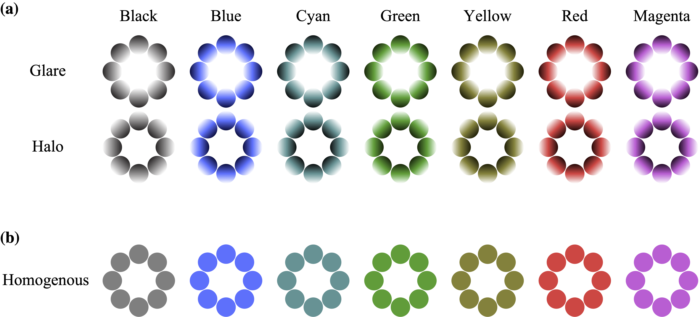
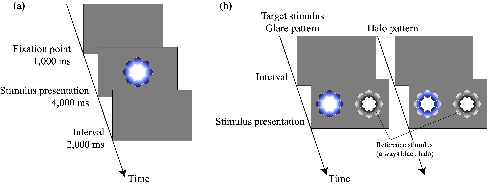

```{r setup, include=FALSE}
knitr::opts_chunk$set(echo = TRUE)
```

```{r child="readFunc.Rmd"}
```

## Article information
Experimental data for "Colorful glares Effects of colors on brightness illusions measured with pupillometry"

Yuta Suzuki, Bruno Laeng, Tetsuto Minami, Shigeki Nakauchi

*Corresponding author: Yuta Suzuki
Department of Computer Science and Engineering, Toyohashi University of Technology, 1-1 Hibarigaoka Tempaku, Toyohashi, Aichi 441-8580, Japan
E-mail address: suzuki14@vpac.cs.tut.ac.jp


## Figure 1
```{r, echo=FALSE, out.width = '100%'}

```

Fig. 1. Experimental stimuli. (a) Both the central glare illusion (above) and the peripheral halo stimuli (below) consisted of luminance gradient circles that either converged towards the pattern's center or turned towards its periphery. As a result, the central region of each glare pattern (top row) typically appears brighter than the corresponding central region of the halo stimulus (bottom row) despite both having the same photometric light intensity. Indeed, simply inspecting this figure should demonstrate that the perceived intensity of each pattern varies with the color of the inducers. (b) The homogeneous colors averaged the inducers of gradient pattern were used in Experiment 3.

## Figure 2
```{r, echo=FALSE, out.width = '100%'}

```

Fig. 2. Experimental design of Experiments 1 and 2. (a) Experiment 1: Each trial consisted in the presentation of the central fixation point for 1000 ms, followed by a stimulus presentation for 4000 ms. Each trial was separated by an inter-stimulus interval (ISI) of 2000 ms. (b) Experiment 2: Participants clicked the mouse in the initial blank screen to continue to the stimulus presentation; subsequently the participant adjusted the luminance of the canter region of the reference stimulus using a “trackball”. Panel (b) illustrates the target stimuli in the blue Glare or Halo conditions. (For interpretation of the references to color in this figure legend, the reader is referred to the web version of this article.)

## Figure 3
```{r, message=FALSE, warning=FALSE, include=FALSE, echo=FALSE}
sTime = -0.2
eTime = 4
countFigNum = 1

#### file loading 
load("dataset_e1.rda")

numOfSub = length(unique(data_e1$sub))
subName = NULL
for( i in seq(max(data_e1$sub))){ subName = rbind(subName,paste("s", i, sep = ""))}
data_e1$sub = subName[data_e1$sub]

### show graph
data_e1_ave = aggregate( data_y ~ Color*Pattern*data_x, data = data_e1, FUN = "mean")

config <- list(lim_x = c(sTime, eTime),
               lim_y = c(min(data_e1_ave$data_y), max(data_e1_ave$data_y)),
               alpha = 0.1,
               stride = 0.1,
               label_x = "Time [sec]",
               label_y = "Pupil Changes [mm]",
               title = "",
               grCol = rep(c("Black","Blue","Cyan","Green","Yellow","Red","Magenta"),2)
)

p <- disp(data_e1_ave,config,0,c("Color","Color"))
p <- p + facet_grid(. ~ Pattern)

p = setFigureStyle(p)

p <- p + theme(
  legend.position = 'none'
)
eval(parse(text=paste("p", countFigNum ,"=p", sep="")))
countFigNum = countFigNum+1

## mean during time from 0sec to 4sec
data_e1_anova = aggregate( data_y ~ sub*Color*Pattern, data = data_e1, FUN = "mean")

#### ANOVA
anovakun(data_e1_anova,"sAB",gg=T,long=T, peta=T)
# output2wayANOVA(forDrawingSigANOVA)
# sigPair = makeSigPair(forDrawingPost)

## mean during time from 0sec to 4sec
data_e1_plot = aggregate( data_y ~ Color*Pattern, data = data_e1_anova, FUN = "mean")
std_data = aggregate(data_y ~ Color*Pattern, data=data_e1_anova, FUN = "sd") 
std_data$data_y <- std_data$data_y / sqrt(numOfSub)

std_data$SE_min <- data_e1_plot$data_y - std_data$data_y
std_data$SE_max <- data_e1_plot$data_y + std_data$data_y

### bar plot
config <- list(lim_x = c(0.5,7.5),
               lim_y = c(min(std_data$SE_min), max(std_data$SE_max)),
               stride =c(-0.3,-0.2,-0.1,-0.0,0.1,0.2),
               label_x = "Condition",
               label_y = "Averaged Pupil Changes [mm]",
               title="average",
               gr = c("Black","Blue","Cyan","Green","Yellow","Red","Magenta",
                      "#FFFFFF","#FFFFFF","#FFFFFF","#FFFFFF","#FFFFFF","#FFFFFF","#FFFFFF"),
               gr_outline = rep(c("Black","Blue","Cyan","Green","Yellow","Red","Magenta"),2)
)

p <- ggplot(data_e1_plot, aes(x = Color, y = data_y, fill = interaction(Color,Pattern)))+
  geom_bar(stat = "identity", position = "dodge", colour = config$gr_outline)+
  # scale_fill_manual(values = c("blue","white")) +
  scale_fill_manual(values = config$gr) +
  
  geom_errorbar(data = std_data, aes(ymin = SE_min, ymax = SE_max),
                width = 0.3, size=0.2, position = position_dodge(.9) ) +
  
  geom_hline(yintercept=0, colour="black", linetype="solid", size = 0.5) +
  # ylim(config$lim_y) + 
  xlab(config$label_x) + ylab(config$label_y)

# p <- drawSignificance(p,sigPair,0.12,0.015)

p = setBarFigureStyle(p)
p <- p + theme(
  legend.position = 'none',
  axis.ticks.x = element_blank(),
  axis.text.x = element_text(angle = 30, hjust = 1),
  axis.line.x = element_blank()
)
eval(parse(text=paste("p", countFigNum ,"=p", sep="")))
countFigNum = countFigNum+1

```

```{r, message=FALSE, warning=FALSE, echo=FALSE, fig.height=4, fig.width=10}
p = combineGraphs(seq(1,countFigNum-1),'p',layout)
plot(p)
```

Fig. 3. Pupillary responses in Experiment 1. Pupillary responses in Experiment 1. The horizontal axis indicates the time (in second), while the vertical axis indicates the grand-averaged change in pupil dilation from baseline (the gray shaded area, from −200 ms to 0 ms, shows the time range of the baseline). (a) Each line color shows the result of averaged pupil diameter to the halo stimuli and colored glare. (b) The average pupil changes in 4 s of viewing (c) the peak pupil constriction for each Pattern and Color condition. The asterisks (*) indicate a statistical significance of p < 0.05. Error bars indicate the standard error of the mean.


## Figure 4
```{r, message=FALSE, warning=FALSE, echo=FALSE, include=FALSE}

countFigNum = 1
SIZE_FONT=20

#### file loading 
load("dataset_e2.rda")

# exclude the participants rejected in pupillometry(exp1)
data_e2 <- subset(data_e2, sub != 7 & sub != 13 & sub != 9)

numOfSub = length(unique(data_e2$sub))
numOfcondition = 14
anova_data_e2 <- aggregate( data_afy ~ sub*Color*Pattern, data = data_e2, FUN = "mean")

anovakun(anova_data_e2,"sAB",gg=T,long=T, peta=T)
# output2wayANOVA(forDrawingSigANOVA)
# sigPair = makeSigPair(forDrawingPost)

config = list(lim_x=c(0.5,8),
              lim_y = c(-5,25),
              stride = 10,
              label_x = "",
              label_y = "Adjusted luminance score [%]",
              title="average",
              gr = c("Black","Blue","Cyan","Green","Yellow","Red","Magenta",
                     "#FFFFFF","#FFFFFF","#FFFFFF","#FFFFFF","#FFFFFF","#FFFFFF","#FFFFFF"),
              gr_outline = rep(c("Black","Blue","Cyan","Green","Yellow","Red","Magenta"),2)


)
config$stride = round(seq(config$lim_y[1],config$lim_y[2],config$stride),1)

jitterVal <- c(rep(-0.225,numOfSub*(numOfcondition/2)),rep(0.225,numOfSub*(numOfcondition/2)))

data_e2_ave <- aggregate( data_afy ~ Color*Pattern, data = data_e2, FUN = "mean")
std_data = aggregate(data_afy ~ Color*Pattern, data=data_e2, FUN = "sd") 
std_data$data_afy <- std_data$data_afy / sqrt(numOfSub)

SE_min <- data_e2_ave$data_afy - std_data$data_afy
SE_max <- data_e2_ave$data_afy + std_data$data_afy

p <- ggplot(data_e2_ave, aes(x = Color, y = data_afy, fill = interaction(Color,Pattern)))+
  geom_bar(stat = "identity", position = "dodge", colour = config$gr_outline)+
  scale_fill_manual(values = config$gr) +
   geom_hline(yintercept=0, colour="black", linetype="solid", size = 0.5) +
  geom_errorbar(aes(ymin = SE_min, ymax = SE_max),
                width = 0.4,
                size=0.2,
                position=position_dodge(.9)) +
  coord_cartesian(xlim = config$lim_x, ylim = config$lim_y)+
  xlab(config$label_x) + ylab(config$label_y)+ 
  scale_y_continuous(breaks = config$stride,expand = c(0, 0))


p = setBarFigureStyle(p)
# p <- drawSignificance(p,sigPair,37,1)

p <- p + theme(
  legend.position = 'none',
  axis.ticks.x = element_blank(),
  axis.text.x = element_text(angle = 30, hjust = 1),
  axis.line.x = element_blank()
)

eval(parse(text=paste("p", countFigNum ,"=p", sep="")))
countFigNum = countFigNum+1

```

```{r, message=FALSE, warning=FALSE, echo=FALSE, include=FALSE}
load("dataset_e2.rda")
# exclude the participants rejected in pupillometry(exp1)
data_e2 <- subset(data_e2, sub != 7 & sub != 8 & sub != 13)
data_e2 <- data_e2[data_e2$Pattern == "Glare",]

load("dataset_e1.rda")
data_e1 = aggregate( data_y ~ sub*Color*Pattern, data = data_e1, FUN = "mean")
# exclude the participants who had a noisy pupil data or didn"t participante in exp2"
data_e1 <- subset(data_e1, sub != 7 & sub != 13 & sub < 18)

data_e1 <- data_e1[data_e1$Pattern == "Glare",]
data_e2$PLR <- data_e1$data_y

subName = NULL
for( i in seq( length(unique(data_e2$sub))) ){ 
  subName = rbind(subName,paste("s", i, sep = ""))
}
data_e2$sub = rep(subName, numOfcondition/2)

config = list(lim_x = c(-20, 40),
              lim_y = c(-1, 0.7),
              stride = c(-0.4,-0.0,0.4),
              alpha_val = 0.7,
              label_x = "Adjusted luminance score [%]",
              label_y = "Pupil Changes [mm]",
              grCol= c("Black","Blue","Cyan","Green","Magenta","Red","Yellow"))

data_e2_ave = aggregate(data_e2, by=list(Color=data_e2$Color,Pattern=data_e2$Pattern), FUN = "mean")

p_val = NULL
indCoff_y = NULL
for( i in 1:numOfcondition ){
  tmpData = data_e2[data_e2$sub == subName[i],]
  lm = lm(PLR ~ data_afy, data = tmpData)
  newavg <- data.frame(data_afy = config$lim_x[1]:config$lim_x[2])
  newavg$reaction <- predict(lm, re.form = NA, newavg)
  indCoff_y = cbind(indCoff_y,newavg$reaction)
  p_val =  cbind(round(summary(lm)$coefficients[2,"Pr(>|t|)"], digits = 4))
}

indCoff <- data.frame(
  y = matrix(indCoff_y,ncol = 1),
  x = newavg$data_afy,
  sub = rep(subName,times=rep( dim(newavg)[1], numOfcondition))
)

lm = lmer(PLR ~ data_afy + (1+data_afy|sub), data = data_e2)
print(paste("y = ", round(summary(lm)$coefficients[2,"Estimate"], digits = 4),
            "x + ", round(summary(lm)$coefficients[1,"Estimate"], digits = 4),
            ", t = ", round(summary(lm)$coefficients[2,"t value"], digits = 4),
            ", p = ", round(summary(lm)$coefficients[2,"Pr(>|t|)"], digits = 4),
            ", R = ", round(cor(data_e2$data_afy,data_e2$PLR), digits = 4), sep=""))


# Data frame to evaluate average effects predictions on
newavg <- data.frame(data_afy = (config$lim_x[1]-20):(config$lim_x[2]+20))
newavg$reaction <- predict(lm, re.form = NA, newavg)

p <- ggplot() +
  geom_line(data = newavg,aes(x = data_afy, y=reaction), col = "black", size = 1) +
  geom_point(data = data_e2, alpha = config$alpha_val,
             aes(x = data_afy, y = PLR, colour = Color, fill = Color), size = 2) +
  scale_color_manual(values = config$gr) +
  xlim(config$lim_x) +
  xlab(config$label_x) + 
  ylab(config$label_y)

p <- setFigureStyle(p)
p <- p + theme(
  # legend.position = 'none',
  axis.line.x = element_blank(),
  axis.line.y = element_blank()
)

eval(parse(text=paste("p", countFigNum ,"=p", sep="")))
countFigNum = countFigNum+1

```

```{r, message=FALSE, warning=FALSE, echo=FALSE, fig.height=4, fig.width=10}
## figure output -----------------------------------------------------------
p = combineGraphs(seq(1,countFigNum-1),'p',layout)
print(p)

```

Fig. 4. Results of adjusting luminance for each colored glare illusion. (a) The vertical axis shows the adjusted luminosity compared to the achromatic halo condition. The colored circle indicates the averaged data among the participants in each colored glare and halo condition. (b) Scatterplot between the averaged pupil diameter in the glare condition and adjusted relative luminance ratio (each dot indicates the participants' means of the relative luminance ratio and pupil diameter). Each colored circle indicates the results of each color type of glare illusion. The interpolating black line shows the simple regression line of LMM as fixed effect.
